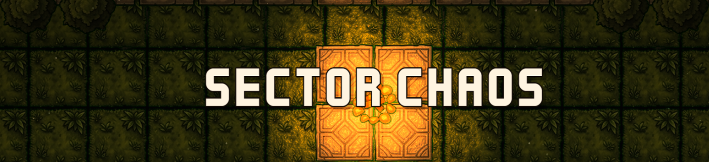

# ⚔️ Sector Chaos

<p>
  
  
  
  
  
  
  
</p>

<p align="center">
  
</p>

---

## 🎮 What is this?

**Sector Chaos** is a real-time, 64-player battle royale for the web — Bomberman's destructible grid arenas meets skill-based melee combat. One match runs about ten minutes: 64 players drop into a freshly generated arena, arm themselves, and fight through named districts while the zone sieges the map's walls inward — ring by ring — until only one player is left standing to extract. Matchmaking, spectators, kill feed, and a full lobby → sudden-death → results lifecycle included.

It's also a **showcase project**: a complete, vertically-sliced multiplayer game built to demonstrate production-grade netcode, simulation, rendering, and AI engineering. Every system is wired end-to-end — input → prediction → network → authoritative server → reconciliation → rendering.

<p align="center">
  
</p>

## 🗺️ The arena — a new 10,240 × 10,240 px world every match

Every match generates a fresh **80×80-tile arena — 10,240 × 10,240 pixels** — from a single seed. Same seed, same map, byte-for-byte; different seed, a completely different world. No two matches play on the same layout.

- **16 structural layouts across 4 sector archetypes** — overgrown mazes, crate-yard lattices, open plazas, and treasure vaults — each stitched together by 3-wide corridors and overwritten by cross-map **macro features**: a highway spine carved through the center band, a 10×10 walled **Mega-structure** with a chest courtyard, seed-rolled barrier ridges and merged open commons, and a rare **14×14 Citadel fortress** that appears on ~10–15% of seeds.
- **Named Districts** — the map names itself. Every district gets a unique generated name and a hero landmark with a tier-colored beacon; the minimap always tells you where the fight is (`RINGROAD • SPIRE • 63`).
- **Loot authored into the geography** — a HOT/WARM/COLD tier pyramid decides where the good weapons live, one sector is promoted to **hot sector** each match to pull players together, and a map-wide legendary budget caps the endgame arms race.
- **Fair by construction** — spawn values are bounded against the per-sector median and repaired deterministically before the map ships.
- **Destructible everything** — walls, crates, and chain-reacting barrels. Break a wall to open a sightline, close one behind you, or bait a fight into a barrel field.

## ⚔️ Combat & loot — melee-first, tier-scaled

- **15 pickup weapons + fists across 4 rarity tiers** (Common → Legendary). Legendaries aren't just sharper: ~5× the lifetime output of a common, so a found upgrade changes the fight.
- **5 attack archetypes with distinct hitbox geometry** — arc sweeps, thrust lines with close-range dead zones, thrown weapons, ranged, and passive shield blocks. Per-weapon windups you can read and dodge, knockback, stagger, and durability that burns on every connect.
- **Honest collision** — SAT polygon hitboxes with two-stage wall occlusion: no hitting through corners, no phantom blocks at wall edges.
- **Barrels are a weapon system** — any first hit primes a barrel, a 5-second fuse burns, then a 50-damage chain-capable explosion. Barrel fields are strategy.
- **Chests, ground drops, 3 trap types (spike / fire / teleport), and 3 power-ups** — sourced from the seed-authored tier pyramid, contested in plain sight.

## 🌀 The closing zone — a siege, not a circle

The safe zone shrinks through **six phases, from the full map down to 8% of its radius**. Outside the circle, the map itself turns on you: **sector walls cascade inward ring by ring**, each drop telegraphed half a second ahead — and a wall solidifying on your tile deals siege crush that bypasses every invulnerability. When time runs out, **overtime sudden death** freezes the zone, accelerates the siege to 1.5-second intervals, and closes walls *into* the safe zone. Camping is not a plan.

## 🤖 64 players — and the bots are worth fighting

Bots fill the lobby to 64 and are built to be believed:

- **5 persistent personalities** (Aggressor, Duelist, Survivor, Scavenger, Trapper) with continuous behavioral weights — no two bots play alike, and the same bot stays itself all match.
- **They hear the world** — explosions, attacks, and chest opens propagate by hearing radius; bots investigate fights, remember where they last saw you (and lose you when you break line of sight), and rotate to quiet sectors when the map runs hot.
- **Human-legible reactions** — reflex interrupts fire with realistic latency distributions: they flinch, dodge windups, zigzag under projectile fire, and panic-react to explosions.
- **They play the economy** — contest loot with claims and intercepts, pre-position for the next zone, respect the tier pyramid, and take over AFK humans mid-match.

All of it runs through the **same queued-input pipeline as human players** — the simulation can't tell them apart — under an enforced **≤4ms-per-tick global AI budget**.

## 🛠️ Under the hood

- **Server-authoritative at 60 ticks/sec** — the client never decides game state. Client-side prediction with server reconciliation (per-player input acks, adaptive render-offset snapping), interpolated remote entities, latency compensation capped at 100ms.
- **A deterministic fast-forward benchmark** — an entire 10-minute, 63-bot match in-process in ~20 seconds of wall-clock; same seed, byte-identical JSON report, used as an AI-quality regression gate.
- **A custom deferred lighting pipeline** in WebGL: albedo RT → Sobel normals → HDR lit pass → half-res bloom → ACES/grade composite, with a deterministic ≤80-light on-screen budget — [full spec here](docs/architecture/lighting.md).
- **Deterministic IK animation** — a shared, tick-based pose simulation (two-bone law-of-cosines arm solver, spring dynamics, per-weapon pose library) runs identically on server and client; the server's weapon segment **is** the authoritative melee hitbox.
- **Seeded map identity** — Named Districts, tier pyramids, and landmarks all derived deterministically from the match seed.

---

## 🚀 Getting Started

### Prerequisites

- **Node.js ≥ 20** and **pnpm ≥ 9**
- Docker (optional, for containerized runs)

### Local development

```bash
# 1. Install dependencies
pnpm install

# 2. Run the server (terminal 1) — listens on ws://localhost:2567
pnpm --filter @sector-battle/server dev

# 3. Run the client (terminal 2) — serves on http://localhost:5174
pnpm --filter @sector-battle/client-v3 dev
```

> If your server isn't on the default `ws://localhost:2567`, set `VITE_SERVER_URL` before starting the client.

### Docker

All commands work from the repo root (the root `docker-compose.yml` includes the canonical definitions in `docker/`):

```bash
docker compose up -d --build      # full stack (client + server)
docker compose down               # stop
```

- **Client:** http://localhost:8080 · **Server:** ws://localhost:2567
- **Server logs:** `docker logs secto-chaos-neo-server-1`

---

## 🧪 Testing & Benchmarks

```bash
pnpm test          # typecheck + lint + all Vitest suites across the monorepo

# The standout: a full 63-bot match, deterministic at fixed seed, in ~20s wall-clock
pnpm --filter @sector-battle/server run bench:bot-ai
```

The **fast-forward harness** uses `@colyseus/testing` to instantiate the real `GameRoom`, then drives `orchestrator.update(TICK_INTERVAL)` synchronously with a virtual clock — a 600-second match finishes in seconds, writing a JSON report to `packages/server/bench-results/`. Same `BENCH_SEED` → byte-identical report (modulo wall-clock fields), so simulation/AI changes are regression-checked by diffing. Tunables (`BENCH_BOTS`, `BENCH_DURATION`, `BENCH_SEED`, …) are documented in [AGENTS.md](AGENTS.md).

---

## 📚 Documentation

The docs suite is indexed at [`docs/README.md`](docs/README.md) — the highlights:

- [**GDD.md**](docs/GDD.md) — the business-rules source of truth
- [**architecture.md**](docs/architecture.md) — the codemap: packages, relationships, invariants (+ per-system deep-dives in [`docs/architecture/`](docs/architecture/): [netcode](docs/architecture/netcode.md) · [simulation](docs/architecture/simulation.md) · [bot-ai](docs/architecture/bot-ai.md) · [map-generation](docs/architecture/map-generation.md) · [client](docs/architecture/client.md) · [combat-and-loot](docs/architecture/combat-and-loot.md))
- [**architecture/lighting.md**](docs/architecture/lighting.md) — the deferred lighting pipeline: pass chain, light budget, tonemap tiers
- [**navigation.md**](docs/navigation.md) — the codebase tour
- [**glossary.md**](docs/glossary.md) · [**performance.md**](docs/performance.md) · [**gotchas.md**](docs/gotchas.md)

---

## 📄 License

Released under the **MIT License** — see [`LICENSE`](LICENSE).
