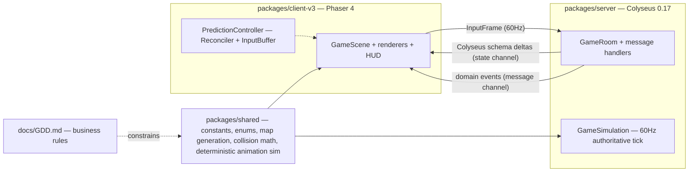
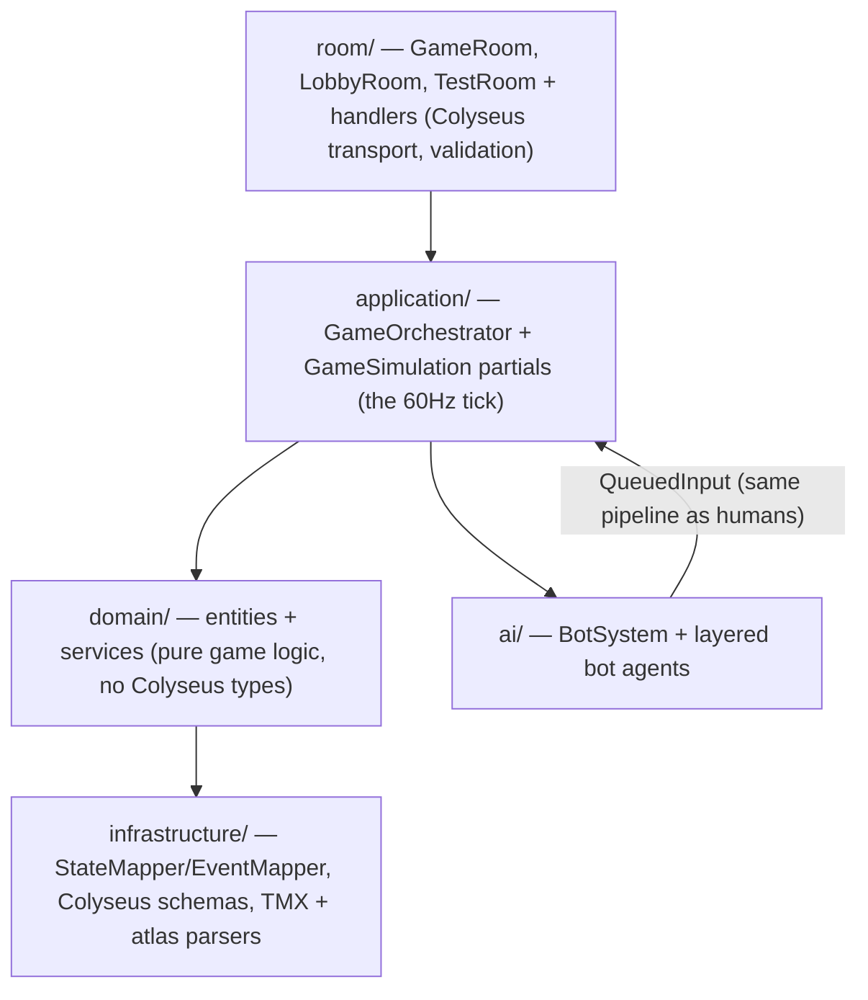

# Architecture — the codemap

This is the maintainer's mental map of Sector Chaos Neo: the bird's-eye view, the three packages and how they relate, the layering inside each, and the invariants that are invisible from random code reading. Per-system deep-dives live in [`architecture/`](README.md) — this page stays coarse on purpose (things that rarely change).

> **Scope rule:** the [GDD](GDD.md) is the business-rules source of truth (numbers, timings, behaviors). This page describes *where things live and how they connect*, linking ADRs for the *why*.

## Bird's-eye view

Sixty-four players (humans + bots) drop into a seeded, procedurally generated arena of destructible walls and loot. A Colyseus server runs the authoritative 60Hz simulation; clients predict movement locally, reconcile against server truth, and render. A closing zone sieges sector walls inward until one player extracts.



## The three packages and their relationship

The monorepo is three packages plus infra (`docker/`, `scripts/`, `.github/`), orchestrated by pnpm workspaces + Turborepo. The dependency arrows point one way, and that direction **is** the architecture:

```
shared  ←  server      (server imports shared; never the reverse)
shared  ←  client-v3   (client imports shared; never the reverse)
server  ⇄  client-v3   (only across the network — no imports either way)
```

### `packages/shared` — the contract layer

Everything both sides must agree on, with **zero framework knowledge**: no Colyseus, no Phaser. Its single runtime dependency is `loglevel` (the shared logger all packages use) — beyond that it must stay deterministic and engine-agnostic so the server can trust it byte-for-byte.

- `constants/` — the game's tunable numbers (`player.ts` with `HITBOX 96×96`, `PICKUP_RADIUS 64`, `BASE_SPEED 430`; `combat.ts`; `zone.ts`; `match.ts`; …). GDD §16 is the table of record; these files are its executable form.
- `enums/` — `InputAction`, `AttackType`, `MatchPhase`, `WeaponType`, `SectorType`, `AnimPhase`, … synced over the wire, so their numeric values are frozen (append-only).
- `network/InputRingBuffer.ts` — the `Float64Array` input history (stride 21 = 13 base fields + 2×4 substep directions, ADR-0007).
- `map/` — the entire procedural map generator (see [architecture/map-generation.md](architecture/map-generation.md)): sector skeletons, macro features, Named Districts identity, loot tiers, fairness gates. Runs identically wherever it's invoked; all randomness is seed-salted (ADR-0035).
- `animation/` — the deterministic per-tick pose simulation, including the two-bone IK arm solver (see [architecture/client.md](architecture/client.md#the-deterministic-animation-sim--ik)). Lives in shared because **the server runs it too** — its weapon-segment output is the authoritative melee hitbox.
- `collision/`, `math/`, `weapons/`, `loot/`, `simulation/` — SAT primitives, sector-polygon builders, DDA raycasts, weapon registry, shared step helpers.

### `packages/server` — the authority

Layered top-down; each layer only knows the ones below it:



- **`room/`** is the Colyseus surface: `GameRoom` (onCreate/onJoin/onLeave, `setSimulationInterval`), `handlers/input.ts` (rate-limit → Zod-validate → clamp → enqueue), `LobbyRoom` + `matchmaking/Matchmaker.ts` (MMR grouping, bot fill).
- **`application/`** owns the match lifecycle: `GameOrchestrator` (+ `…Init/Phases/Eliminations` partials) wraps `GameSimulation` (+ `…Input/Combat/Loot/Walkovers` partials) — the fixed step order is documented in [architecture/simulation.md](architecture/simulation.md).
- **`domain/`** is pure logic: `entities/Player.ts` (+ combat/movement partials), `services/` (`MovementService`, `CollisionService`, `DamagePipeline`, `ZoneService`, `MapSiegeService`, `LootService`, `SpawnService`, `EliminationService`, `SuddenDeathService`, `ReconnectionManager`, …). No schema types here.
- **`infrastructure/`** maps domain → wire: `StateMapper`/`StateMapperSync` (batched delta projection), `EventMapperHandlers` (domain events → broadcast messages), `schemas/` (the 11-`MapSchema` `GameStateSchema`), TMX/atlas/lighting parsers for map hydration.
- **`ai/`** is the largest subsystem — the bot-ai-v2 layered agent ([architecture/bot-ai.md](architecture/bot-ai.md)). Bots are players: they emit `QueuedInput`s through the same pipeline as humans and never mutate state directly.

### `packages/client-v3` — the prediction + rendering layer

Phaser 4 + Vite. Never imports server code; treats every server fact as authoritative input.

- `scenes/` + `ui/` — `MainMenuScene`, `MatchmakingScene` (lobby + seat reservation), the reusable UI kit (Panel/Button/Label/ProgressBar over nine-slice game-assets art, `DesignTokens`, the persistent `TransitionScene` wipe, ADR-0011).
- `network/` — `Connection`, `StateSync` (schema subscriptions), `EventRouter` (message subscriptions).
- `bridges/` — `state-sync/` (server state → `GameState` + `PlayerReconciler`) and `event-handlers/` (per-event visual reactions). The bridge layer is the only writer of authoritative client state.
- `controllers/` + `prediction/` — `PredictionController` owning `Reconciler` + `InputBuffer`; `EntityInterpolator` for remote players; `InteractionDetector`, `SpectatorController`, `HUDUpdateService`.
- `rendering/` — `MapRenderer` (static bake), `PlayerRenderer` (+ IK arms), `EntityRenderer` (7 partials), `ZoneRenderer`, HUD/VFX renderers, `CameraService`, and `lighting/` — the deferred pipeline (see [architecture/lighting.md](architecture/lighting.md)).

Full detail: [architecture/client.md](architecture/client.md).

## Architecture invariants

The rules that are easy to break by accident because nothing local enforces them:

- **Server-authoritative, always.** The client never decides game state; prediction is movement-only (ADR-0005, ADR-0014).
- **Bots are players.** Bot output is `QueuedInput`s on the same input path as humans — no direct state mutation (GDD §14, ADR-0039).
- **The local player renders after reconciliation, never before** (ADR-0005).
- **Float determinism is sacred in shared primitives** — no `Math.random` in shared simulation/map code; RNG is seed-salted per concern (ADR-0035).
- **The AI share of the server tick is ≤4ms across all bots**, enforced by `AiBudgetGuard` (GDD §15.3.1b).
- **`shared` stays framework-agnostic** — server and client both trust it; an engine import there poisons the contract.
- **Schema enums are append-only wire contracts** — reordering `MatchPhase`/`AnimPhase`/`InputAction` values desyncs every client.
- **Wiring is implementation** — a renderer that is never called is not a feature (end-to-end verification is the bar, see [AGENTS.md](../AGENTS.md)).

## Cross-cutting concerns

- **Netcode constants** — 60Hz tick, 60Hz state patch (`syncEveryN = 1`), input history 120 ticks, 1px reconciliation threshold, 8px render-offset snap: the verified table lives in [architecture/netcode.md](architecture/netcode.md#netcode-constants).
- **Performance budgets** — the two enforced ones (16.67ms tick, ≤4ms AI) and how to measure: [performance.md](performance.md).
- **Testing** — Vitest per package (~2,240 server / ~1,177 client tests), verbatim-oracle parity tests for behavior-preserving refactors, and the deterministic fast-forward benchmark ([architecture/bot-ai.md](architecture/bot-ai.md#the-fast-forward-benchmark)).
- **Decisions** — non-obvious calls are recorded as ADRs under `docs/adr/`; check whether your change collides with one before touching load-bearing behavior.
- **Finding code** — [navigation.md](navigation.md) is the guided tour; [AGENTS.md](../AGENTS.md) carries the terse 98-entry file map for agents.
