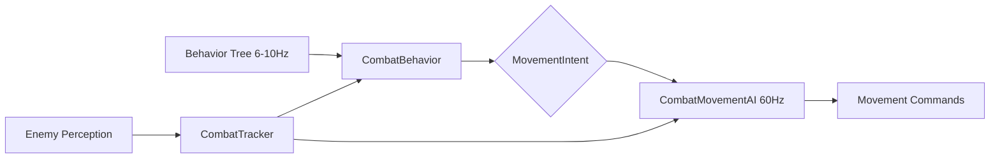

# ADR: 100/100 Bot AI Combat Movement System

**Status:** Proposed
**Context:** Bot AI needs human-feeling brawler combat, not just correct decisions
**Related:** PRD: Bot AI Combat Movement Overhaul

## Background

The current bot AI system uses a sound architecture (Behavior Trees + Utility hybrid, AgentMemory, EngagementEvaluator) but produces robotic movement patterns due to:
1. Binary strafing (left/right, 500-1000ms persistence)
2. Reactive-only dash usage (evasion only, not spacing)
3. Chase-only positioning (never intercept, always react)
4. 474 lines of dead/shadowed behavior code
5. No tactical enemy state tracking (cooldowns, dash availability)

These issues make bots feel like "training dummies with pathfinding" instead of skilled brawler opponents. For a 2D arcade brawler, the quality bar is **spacing and positioning**, not aim precision. Players expect bots that control engagement range, bait whiffs, and punish recoveries — the fighting game "footsies" game translated to top-down.

## Decision

**We will build a dedicated `CombatMovementAI` subsystem that owns 60Hz movement execution during combat, separated from strategic decisions made by the Behavior Tree.**

## Rationale

### The Problem with Current Architecture

The existing `CombatBehavior.ts` (1101 lines) tries to do everything:
- Strategic decisions: who to fight, when to retreat, which weapon
- Tactical decisions: spacing, dash timing, movement patterns
- Execution: `strafeAroundTarget`, approach distance logic

This creates several issues:
1. **Movement patterns are hardcoded and limited** — only binary left/right strafing
2. **Execution is tied to BT evaluation cadence** — 6-10Hz updates make movement feel choppy
3. **No tactical enemy state** — no awareness of enemy cooldowns, dash availability, or damage windows
4. **Separation of concerns violated** — behavior tree shouldn't control movement pixels per tick
5. **Code complexity** — 1101-line file is hard to maintain and extend

### The Architecture Solution



**CombatMovementAI (60Hz)**
- Owns ALL movement decisions during combat
- Executes movement patterns: hover spacing, whiff-bait, stutter-step, commit-and-exit
- Manages dash economy: `dashAvailable ? aggressive : defensive`
- Implements pattern-aware movement prediction
- Queries `CombatTracker` for enemy tactical state

**CombatBehavior (BT, 6-10Hz)**
- Shrinks to strategic decisions: who to fight, when to retreat, zone priority
- Sets `MovementIntent` on context
- Queries `CombatTracker` for engagement math

**CombatTracker (60Hz)**
- Tracks per-enemy tactical state: cooldowns, dash availability, damage math
- Updated from perception data each tick
- Shared data source for both movement and strategic layers

**MovementIntent Contract**
- Defines the "what" (strategic) vs "how" (tactical) separation
- Typesafe, debuggable, extensible
- Ensures clean boundary between BT and subsystem layers

### Why 60Hz Movement?

Brawler combat is timing-sensitive. Movement patterns require smooth execution:
- **Hover spacing**: micro-drift at 90% weapon range (e.g., 2px frame jitter)
- **Stutter-step**: 200ms movement bursts between attacks
- **Whiff punish**: dash-in/attack/dash-out within 200ms window
- **Pattern prediction**: angle calculation 10-20 frames ahead

These cannot happen at 6-10Hz. 60Hz provides smooth, responsive movement that matches human input cadence.

### Three-Zone Spacing Model

The tactical space is divided into three discrete zones based on weapon ranges:

| Zone | Boundary | Behavior |
|------|----------|----------|
| Safe | Outside both ranges | Reposition, flank, circle approach |
| Poke | Inside your range, outside theirs | Hover spacing, whiff-bait, poke |
| Exchange | Inside both ranges | Commit-exit, stutter-step, trades |

Zone boundaries are computed dynamically per weapon pair from `weaponRegistry.baseStats.range`. This creates matchup-specific spacing (e.g., spear vs dagger dynamics).

### Resource Management (Dash Economy)

Dash is the primary spacing tool in a brawler, not just an evasion mechanic. Treating it as a commitment resource creates natural pressure cycles:

```
dashAvailable → aggressive (whiff-bait, commit to punish)
dashCooldown → defensive (safe spacing, stall, wait)
```

This mirrors how human players manage dash as a game-ending resource.

### Intelligence Layer Extension

Bots are hard by default. Three extra intelligence layers provide tactical information that skilled humans track mentally:

1. **Enemy Cooldown Tracking**: `lastAttackTick` → `cooldownRemainingTicks`
2. **Enemy Dash Tracking**: `lastDashTick` → `dashAvailable`
3. **Damage Math Preview**: `hitsToKillThem`, `hitsToKillUs`

These are used by both strategic layers (CombatBehavior engagement decisions) and tactical layers (CombatMovementAI punish windows).

## Implementation Plan

### Phase 1: Cleanup (Prerequisites)
1. Delete shadowed behaviors (`ImprovedBehaviorTree`, `FixedCombat`, `FixedLooting`, `SimpleLooting`)
2. Replace `as any` casts with proper Pathfinder getters
3. Deduplicate RiskTolerance definitions
4. Gate profile code behind debug flag

### Phase 2: Intelligence Layer
5. Implement `CombatTracker` subsystem
6. Add enemy cooldown/dash tracking to `CombatTracker`
7. Add damage math to `CombatTracker`

### Phase 3: Movement System
8. Define `MovementIntent` types in `bt/types.ts`
9. Implement three-zone spacing computation
10. Build `CombatMovementAI` class with 60Hz tick loop
11. Implement all 6 movement patterns
12. Add pattern-aware movement prediction
13. Add whiff punish detection and execution
14. Add multi-enemy position scoring

### Phase 4: Integration
15. Add `CombatMovementAI.execute()` to `BotSystem.tickBot()` sequence
16. Refactor `CombatBehavior` to delegate movement via intent contract
17. Implement difficulty-based execution error injection
18. Rework DDA parameters to control combat-feel

### Phase 5: Validation
19. Build automated metrics scripts (spacing accuracy, punish rate, dash economy)
20. Extend telemetry for movement state visibility
21. Runtime validation: compose build → browser → watch combat

## Consequences

### Positive
1. **Clean separation**: BT owns "what to do", CombatMovementAI owns "how to move"
2. **Smarter bots**: Full tactical awareness of enemy state and spacing geometry
3. **Human feel**: Smooth, intentional movement patterns
4. **Extensible**: New movement patterns easy to add without BT changes
5. **Performance**: 60Hz movement execution without bloated BT evaluation

### Tradeoffs
1. **Increased complexity**: Additional subsystem and coordination contract
2. **Breaking changes**: `CombatBehavior` API changes significantly
3. **New dependencies**: `CombatTracker` becomes required for all bot combat
4. **Telemetry complexity**: More state to track for debugging

## Non-Goals
- No RL/ML for bot behavior (computationally prohibitive, not standard in 2026)
- No GOAP (not used in competitive multiplayer games)
- No team coordination (solo BR context)
- No NavMesh (grid A* sufficient for tile-based 2D)
- No probabilistic perception (bots are hard, not handicapped)

## Related Decisions
- ADR-00024: Server Bot Perception Performance (perception system feeds CombatTracker)
- GDD §14: Bot AI System (redefined movement subsystem in this ADR)
- CONTEXT.md Bot AI Overhaul (new terminology and domain model)

## References
- Halo Infinite GDC 2022 "Deconstructing the Combat Dance" (movement patterns framework)
- Jeff Orkin F.E.A.R. (AgentMemory patterns adapted for tactical state)
- Game AI Pro 360 "Movement and Pathfinding" (JPS+, flow fields not applicable to grid 2D)
- Fortnite/PUBG Bot Behavior (PUBG Ally LLM layer used for strategic comms, not movement execution)
