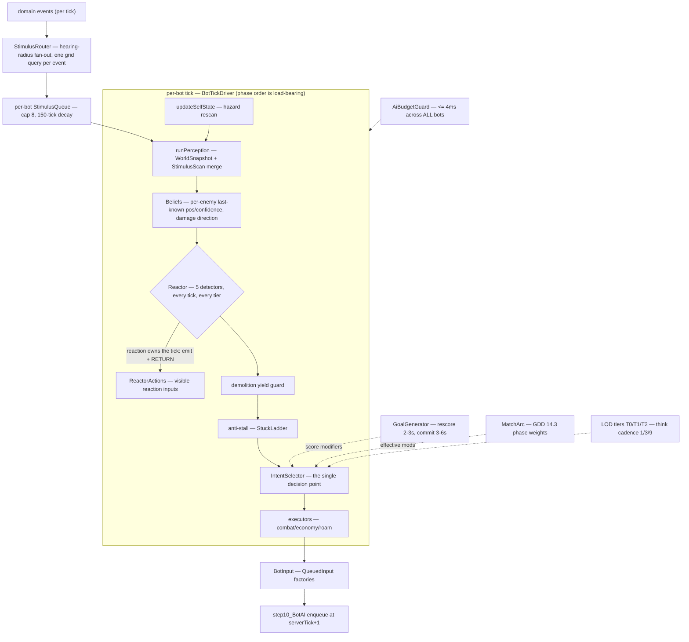
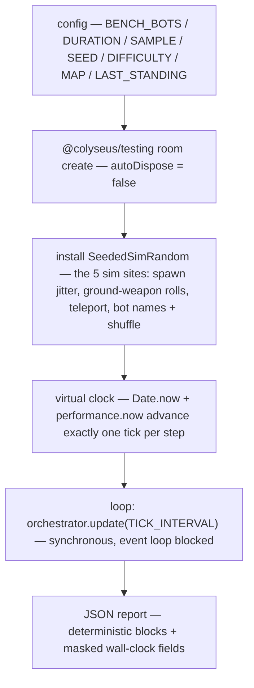

# Bot AI — the v2 layered architecture

Bots are the largest server subsystem and the most documented design in the repo: GDD §14 is the design of record, ADR-0039 records the architecture decision, and `docs/design/bot-ai-v2/` holds the full effort (SPEC, decision log DEC-001..014, orchestrator ledger).

The core idea: **every bot is a player.** Bots perceive a read-only world, decide, and emit `QueuedInput`s through the exact pipeline humans use — they never mutate game state directly. Sixty-three bots and one human are indistinguishable to the simulation.

## The layered stack

### Per-tick phase order (`BotTickDriver` — documented in-code as LOAD-BEARING)

1. `updateSelfState` — per-tick hazard rescan + self sync
2. `runPerception` — scan merge (every tick, all tiers)
3. `syncZoneState`
4. `runMacroGoal` *(think-tick gated)*
5. `runReactionTick` — **a reaction that fires owns the tick**: it emits and returns, bypassing all deliberation by construction
6. demolition yield guard (return on yield)
7. `runAntiStall` — the human-legible stuck ladder: sidestep → back-up-facing → alternate-lane replan → **smash the blocker** → relocation
8. `runIntentSelection` *(think-tick gated)*
9. `runExecutorAndTelemetry`

## The layers

- **Stimulus** (DEC-002) — `StimulusRouter` fans domain events out by hearing radius (explosion 1400 / attack 900 / thrown+elimination 1000 / chest 700 / zone telegraph global / damage 900), feeding per-bot bounded queues. The shared `StimulusFightMemory` hotspot is written **only** by the router.
- **Beliefs** (DEC-003) — the believed-state world model: per-enemy last-known position/velocity/confidence with seen/heard/damage sourcing, damage-direction estimates, search-failure drops, GDD §14.2 detection-range confidence fade and LOS-halving.
- **Reactor** (DEC-004/007) — the reflex interrupt layer: 5 prioritized detectors (imminent-death / incoming-projectile / took-damage startle / explosion-heard / enemy-windup) with per-archetype fixed reaction mixes, ex-Gaussian latency drawn from per-bot RNG (GDD §14.2 reaction times as distribution means), ≤15-tick windows + refractory. Every reaction emits an observable input — reflexes are visible, not teleporting.
- **Intent** (ADR-0036) — `IntentSelector` is the *single* deliberative decision point: 11 intents, commit-window hysteresis, validity-gated preemption (margin 0.18), goal suspension. `PersonalityProfile` shapes scoring with 5 continuous archetypes (AGGRESSOR / DUELIST / SURVIVOR / SCAVENGER / TRAPPER) plus per-difficulty skill knobs.
- **Goal** (DEC-008) — the macro layer above intents: `GoalGenerator` scores loot clusters / quiet-side rotations / unexplored sectors / next-zone pre-positions / hotspot-edge stalks, commits stickily across intent churn. `ZoneTiming` encodes the rotation rule (`timeUntilShrink < travel × margin`, never-lethal shortcuts, endgame hold points).
- **Match arc** (DEC-011) — GDD §14.3 phase-weight table applied verbatim as effective score modifiers: bots escalate over the match, per-archetype slopes.
- **Skill** (DEC-009) — GDD §14.6 MMR difficulty mixes verbatim; `MovementProfileTables`/`BotMovementSignature` (archetype weave/arc/drift movement); `RestrictionTables` (scoped incompetence); `CombatCapTables` — three **independent** caps (accuracy+convergence, reaction, fire discipline).
- **Combat** (DEC-010) — the duel brain (`BotCombatEngage`+Ranged), navigated break-line retreat, demolition, combat weave (sticky zigzag under fire), discretion tables (disengage triggers), kill-feed memory (safe-loot windows, sector danger), item contests (claims + intercept pathing).
- **LOD + budget** (DEC-012) — see below.

Support rails: `WorldSnapshot` (per-tick read-only pooled world view + spatial range queries), `BotNavigation`/`BotNavigationBlend` (`navigateTo` macro-mover over the 8-directional typed-array A\* `Pathfinder`, local steering with the wall-slide invariant "no emitted angle into a wall"), `BotTargeting` (GDD §14.8 target formula incl. recentDamage ×2.0, 45-tick lock), `BotBelievability` + `BotSkillTracker` (observation-only telemetry — never feeds decisions).

## The budget: ≤4ms across all bots

The real contract (GDD §15.3.1b): the Bot-AI share of the server tick is **≤4 ms across ALL bots per tick** — there is no per-bot 8ms budget; that claim described code that no longer exists. `AiBudgetGuard` enforces it on the harness-virtualizable `performance.now()`:

- Relief ladder suspends deliberation: T2 at 3.2ms → T1 at 3.6ms → non-combat T0 at 4.0ms. **Combat-tier T0 never suspends.**
- Always-on at every tier: Reactor, stimulus, hazard rescan, input submission.
- 60 consecutive metric-clock over-target ticks set `sustainedOverrun` → benchmark FAIL.

LOD tiers gate *think cadence* (not the always-on set): T0/T1/T2 think every 1/3/9 ticks; combat entry upgrades a bot's tier immediately.

## BotManager — session lifecycle

`BotManager` owns sessions; `BotSystem` owns minds. Bots enter via async trickle fill (`clock.setInterval` over ~5s — **bots are NOT present right after `onCreate`**; tests poll the player count), can take over AFK humans (`takeoverPlayer` — entity-preserving, `isBot = true`), and draw difficulty from lobby MMR (`BotDifficultyTables`). Names + shuffle route through `SimRandom` for benchmark determinism.

## The fast-forward benchmark

`tests/helpers/bot-benchmark-harness.ts` runs a complete 63-bot match in-process in seconds — the primary AI-quality regression tool:

- **Determinism contract:** same `BENCH_SEED` → byte-identical JSON modulo the wall-clock fields (`timestamp`, `realDurationMs`, `speedup`, `tickBudget`, `aiTime`, `aiBudget`). The `believability` and `lod` blocks are pure observation of the tick stream — unmasked, part of the regression surface.
- **Known trade-off:** the budget guard's clock is the virtualized `performance.now()`, so under the harness every within-tick delta is 0 and the guard deterministically never fires (load-bearing for byte-identity). Budget *realism* is measured separately on the never-virtualized metric clock (`process.hrtime`) — those are the masked fields. Use the Docker server for end-to-end budget realism; the harness for AI-quality regression.
- `BENCH_LAST_STANDING=-1` disables the alive-count end so late zone/siege/overtime phases are exercised (63 hard bots otherwise finish before the zone does).

Commands and env table: [AGENTS.md](../../AGENTS.md) §Benchmarking Commands.

## Verification

Bot-AI changes are proven by: the full test suite, a before/after benchmark diff at fixed seed, and (for visual claims) the Docker server + browser. The believability telemetry (reaction-latency histograms incl. true stimulus→response channels, stall/ladder counters, action diversity, per-archetype cuts) is the "does it still look human" check — observation-only by construction.
