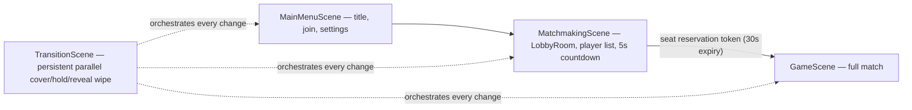
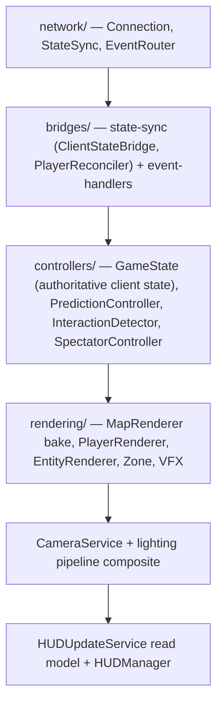
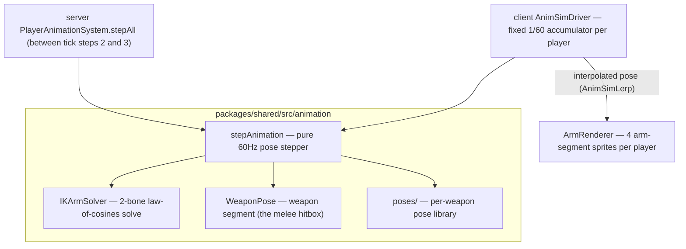

# Client architecture — Phaser 4, prediction, deferred lighting, IK animation

The client is a prediction + rendering layer: it samples input, predicts **movement only**, reconciles against server truth, and renders everything else from authoritative state + events. This page covers the scene flow, the GameScene wiring order, the deferred lighting pipeline, and the deterministic IK animation sim.

## Scene flow

Four scenes register in `main.ts` — `[MainMenuScene, MatchmakingScene, GameScene, TransitionScene]`. Each scene owns its `Colyseus.Client` (never passed between scenes); the `SharedAudioService` singleton persists across transitions.

`SceneNavigator` is the single navigation entry point; `MenuDirector` coordinates menu concerns (audio fade, interactivity lock). See ADR-0011. All scene changes go through the TransitionScene diamond-grid shader wipe — no raw `scene.start`.

## Inside GameScene — the wiring order

`GameSceneSetup.ts` wires systems in a strict layer order that must not be shuffled:

Two load-bearing details:

- **Bridges are the only writers** of `controllers/GameState.ts` (the authoritative client-side mutable state). Renderers only read it.
- **The local player renderer updates after reconciliation, never before** (ADR-0005) — the prediction loop (`PredictionController` → `Reconciler` + `InputBuffer`) runs before the renderer consumes the pose, so snap-back from server corrections is absorbed by `renderOffset` instead of flashing.

Remote players bypass prediction: `EntityInterpolator` smooths them with a 67ms buffer over a 10-snapshot ring, linear interpolation, and a 64px snap for teleports. HUD is a per-frame **read model** (`HUDUpdateService`) — it never owns state.

## The deferred lighting pipeline

`packages/client-v3/src/rendering/lighting/` is a custom WebGL deferred composite — the client's most substantial rendering subsystem, with its own dedicated page: **[architecture/lighting.md](lighting.md)**. The short version here:

- **Why deferred** — a 64-player match runs many simultaneous dynamic lights (auras, explosions, projectiles, fuses, torches, beacons); deferred keeps frame cost at `objects + lights` instead of `objects × lights`.
- **The chain** — world captured into `__albedoRT` (world-depth objects are ignored on the main camera) → Sobel-derived `__normalsRT` → HDR `HdrLit` pass into `__litRT` with the packed light buffers → half-res bloom chain → a camera-internal **Final filter** (custom `FilterFinal` render node) applying ACES tonemap + bloom + grade + vignette and alpha-compositing the HUD. Its output *is* the on-screen image.
- **The budget** — static map placements + per-frame dynamic lights merge under a deterministic cull: distance vs camera rect (+256px margin), then priority trim to **≤80 on-screen** (`PLAYER > EXPLOSION > PROJECTILE > STATIC > AMBIENT_SCATTER > BARREL`); a 256 uniform-loop cap is never silently overflowed.
- **WebGL-only, rebuild-on-resize** — the constructor throws off-WebGL (Canvas degrades to unlit); resize destroys + recreates RTs and shaders (never in-place `setSize`).
- **Atmosphere** — GPU-particle embers/dust at world depth, lit with the world, themed per sector type.

Full spec — per-stage tables, tier ladder constants, lifecycle, diagnostics, module map: [architecture/lighting.md](lighting.md).

## The deterministic animation sim + IK

The arm/weapon poses are **not** a client-side animation effect — they are a deterministic simulation in `packages/shared/src/animation/`, stepped at exactly one pose per 60Hz tick, run identically on server and client. The server's output is authoritative because **the weapon segment it computes is the melee hitbox**.

### The solver

`IKArmSolver.ts` — analytical two-bone IK via the law of cosines:

- Inputs: shoulder position, hand target, bone lengths (`upperArmLen`, `forearmLen`), and a per-arm `bendSign` (left/right elbows bend opposite ways).
- Reach clamping is *soft*: beyond 95% of max reach the target distance compresses through a smoothstep toward 98% of max, so arms straighten naturally instead of snapping; below min reach it clamps to `minReach + ε`. Fully-extended targets short-circuit to a straight arm.
- The elbow is placed at `baseAngle ± α` where `α = acos((d² + L₀² − L₁²) / 2·d·L₀)`; the solution is written into a reused scratch object — zero allocation per solve.

### The sim around the solver

`stepAnimation.ts` is the pure tick stepper (one call = one 60Hz tick). Its determinism contract: no wall-clock (`Date.now`/`performance.now` — oscillators derive from tick counters), no `Math.random` (variation derives from `comboIndex`/tick hashes), fixed spring substeps. Cross-engine `sin/cos` float variance is acceptable because the server is authoritative and reconciliation corrects drift.

State (`AnimSimState`) is plain serializable data: an `AnimPhase` (`IDLE / WALK / WINDUP / STRIKE / RECOVER / BLOCK / DASH / STAGGER / DYING` — uint8-synced, append-only), hand **springs** in local aim space, a weapon-lag angle spring, a body-lean spring, stride distance for the walk cycle. Around the stepper: `AnimationPhase.ts` (phase machine), `AnimationTargets.ts` (targets/lean/sway profiles), `AnimationCollision.ts` (wall-clamps hands out of tiles), `DetSpring.ts` (deterministic springs + impulses), `WeaponPose.ts` (weapon segment = hitbox geometry), and `poses/` — the per-weapon pose library (~20 weapons + category templates, e.g. `longSword`, `crossbow`, `polearm`).

### How each side drives it

- **Server** — `PlayerAnimationSystem.stepAll` steps every player's anim sim between movement and combat resolution each tick; the resulting weapon segment feeds melee hitbox tests.
- **Client, local player** — `AnimSimDriver` predicts phases with the same trigger API (`startAttack` on input; durations tick-quantized via shared `AnimTiming` so windup/cooldown windows match the server exactly). An unconfirmed attack may run at most 12 ticks before server confirmation; phase-age divergence beyond a 2-tick deadband triggers a correction that re-bases the phase clock.
- **Client, remote players** — one driver per player, edge-triggered from synced state/events, applying the same pure impulse functions the server used (`computeAttackerRecoil`, `computeHitFlinch`). `AnimSimLerp` interpolates between tick poses for render-rate smoothness; `AnimDesync` snapshots drift for diagnostics.

### Rendering the arms

`ArmRenderer.ts` is a deliberately **stateless geometry helper**: it owns no per-player map. Each player's `PlayerRenderBundle` owns exactly four arm-segment sprites (upper + forearm × left/right) — a 4×1 white canvas texture, tinted per player, depth 9. `updateArms` positions each segment from the solved `ArmJoints`: midpoint placement, `atan2` rotation, display size `(bone length + 2px overlap) × 6px` — the overlap hides the joint seam. Because the sprites are scene-root objects (not body children), view-culled players get their segments pinned to the body every culled frame (`positionAtBody`) as defence-in-depth against stale-arm flashes after teleports.

What's left of the old client-side controller (`PlayerAnimationController.ts`) is render-only effects that must never touch the simulation — the 100ms hit flash.

## HUD, audio, VFX

- **HUD** — `HUDManager` + widgets (`DeathScreen`, `ResultsScreen`, `SpectatorHUD`, `KillFeedRenderer`, `MinimapRenderer`, `PowerUpIndicators`), all fed by the `HUDUpdateService` read model. UI kit primitives (Panel/Button/Label/ProgressBar) are nine-slice `game-assets/UI` art configured through `DesignTokens` — never raw Phaser text/geometry.
- **Audio** — `AudioService` per game scene; `SharedAudioService` persists across scene transitions with fade support.
- **VFX** — `rendering/vfx/` particle systems (Explosion, Destruction, Pickup, Siege, DamageParticle, WeaponShatter, BeaconMotes) + `AttackVFXRenderer`, `WeaponTrailRenderer`, `GhostTailRenderer` (dash afterimages), `DamageNumberRenderer` (pooled floating numbers), `StatusEffectRenderer` (fresh-spawn/barrier/speed auras).
- **Dev console** — `DebugBridge` exposes Playwright-facing state snapshots, reconciliation logs, and telemetry rings (ADR-0034); `RuntimeGameController` drives server-authoritative dev actions.
