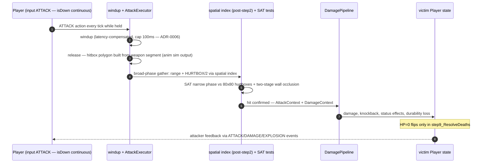
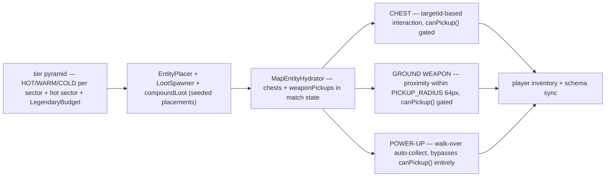
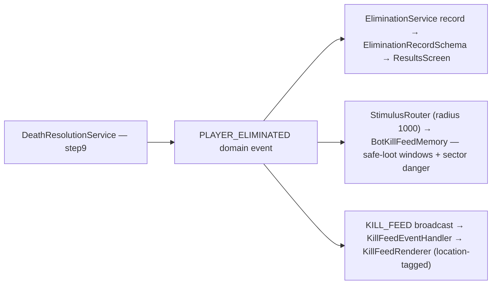

# Combat & loot — resolution and economy

Melee-first combat with five attack archetypes, resolved fully server-side. This page covers the attack flow, the hitbox geometry, the DamagePipeline, and the three loot acquisition paths.

## Attack resolution

### Hitbox geometry per attack type

`AttackType` — ARC, LINE, THROWN, RANGED, SHIELD (passive block derived from equipped shield + blockable state):

| Type | Geometry | Notes |
| --- | --- | --- |
| ARC | 7-vertex sector polygon (inner radius 40px = hurtbox edge → no self-hit; outer = range + 40px) | built by `buildSectorPolygon()` in `shared/src/math/` |
| LINE | 4-vertex rotated rectangle, 20px wide, per-weapon `lineStartOffset` dead zone | thrust weapons; effective range wall-clipped by DDA |
| THROWN / RANGED | projectile geometry, advanced in step 4 | arrows/thrown weapons; durability consumed on hit |
| SHIELD | passive — no hitbox | `isBlocking` derived in StateMapper |

Hurtboxes are axis-aligned 80×80 (sub-visual: movement hitbox is 96×96), never rotating. Wall occlusion is two-stage: DDA center-to-center fast reject, then SAT the wall tile's AABB against the hitbox polygon — corner-clipping hits around walls land, genuine blocks don't (ADR-0022, ADR-0021).

### Damage pipeline + destructibles

`DamagePipeline` is the single resolution path for PvP damage, knockback, and status effects. Destructible damage is a **separate stat** (`destructibleDamage`, 2–10 per weapon class, NOT tier-scaled — it encodes class identity: Hammer breaks walls, Spear doesn't). Barrels are the exception: any first hit primes (1 HP), a 5s fuse follows, the second hit — or the fuse — detonates a chain-capable 50-damage explosion.

## The loot economy

Three acquisition paths with deliberately different gating, all sourced from the seed-authored tier pyramid ([map-generation.md](map-generation.md#named-districts-adr-0038)):

- **`canPickup()`** (`PlayerCombat.ts`) returns false during dash/stagger/windup/attack-cooldown — and gates **weapons only**. Power-up walk-over bypasses it by design.
- Chest rolls come from `LootService.rollChestLoot(chestTier, rng)` + `CHEST_LOOT_TABLES`; destroyed crates/barrels drop via `processDestroyedDestructibles`.
- Tier scaling applies to PvP `damage`/`range`/`knockback` via `TIER_STAT_MULTIPLIER` (×1.0/1.25/1.75/2.0) at the point of use in `AttackExecutor`; durability scales UP with rarity (8→20), so a legendary has ~5× the lifetime output of a common — the exact traps are documented in [gotchas.md](../gotchas.md).
- Bots engage the same economy: `ItemContests` (persistent claims + intercept pathing + break-off), `GoalScoringLoot`, economy executors.

## Eliminations & kill feed

Death is resolved once (step 9) and fanned to three consumers:

The dead player's flow: 0.5s death animation (body retains collision) → weapon drop ring → spectate camera follows the killer (Q/E cycles targets, Space toggles free camera). Disconnect/AFK ladders into a bot takeover at 60s — the entity persists.
