# The deferred lighting pipeline

The client's custom WebGL lighting system: `packages/client-v3/src/rendering/lighting/` (38 modules) plus the GLSL sources in `src/shaders/lighting/*.frag`. This page is the full architecture spec — motivation, pass chain, light budget, tonemap tiers, lifecycle, and diagnostics.

## Why deferred

A 64-player match on a Named-Districts map is full of simultaneous dynamic lights: player auras, explosions, projectile glows, burning barrel fuses, flickering torches, landmark beacons, ambient embers. Forward lighting would cost roughly `objects × lights` per frame; the deferred approach renders the unlit world once into a g-buffer and composites all lights against it — cost scales as `objects + lights`. That property is what makes the ≤80-light budget below a *perf* control rather than a visual compromise.

**WebGL-only by construction:** the pipeline's constructor throws off-WebGL and `bootLightingPipeline` returns `null` on Canvas, so the game degrades gracefully instead of crashing.

## The pass chain

`LightingPipeline` (the controller, constructed after the world is built) drives five render-target shader stages plus one camera-internal filter per frame. The GLSL lives in `.frag` files loaded verbatim via `?raw` imports — the files are the single source of truth for the shaders.

```mermaid
flowchart LR
    WORLD["visible world — world-depth GameObjects, ignored on the main camera"]
    ALB["__albedoRT — albedo capture, viewport-sized"]
    NRM["__normalsRT — Sobel-derived normals"]
    LIT["__litRT — HDR lit output"]
    BLB["bloom chain — Bright, H-blur, V-blur (half-res)"]
    BLV["__bloomVRT"]
    FIN["Final filter — camera-internal: ACES + bloom + vignette + grade + HUD composite"]

    WORLD -- "captureWorldIntoAlbedo (incremental registry)" --> ALB
    ALB -- "Sobel" --> NRM
    NRM -- "HdrLit + packed light buffers" --> LIT
    LIT --> BLB --> BLV
    LIT --> FIN
    BLV --> FIN
    FIN --> OUT(["screen"])
```

| Stage | Owner | Spec |
| --- | --- | --- |
| Albedo capture | `LightingAlbedoRtBuilder` + `LightingWorldCaptureRegistry` | World-depth objects are excluded from the main camera and captured into `__albedoRT` instead ("Option B" camera setup — the HUD stays on the main camera, the world lives in the lit RT). The capture list is maintained **incrementally** on display-list add/remove events, not rescanned per frame; an order-equivalence harness (`__LIGHTING_CAPTURE_COMPARE__`) proves it matches the old full scan. |
| Normals | Sobel shader | Normals are derived from the albedo RT — no normal-mapped art exists. Strength via `SOBEL_STRENGTH` (per-instance override in the pipeline options). |
| Lighting | `HdrLit` shader | Samples the packed light uniform arrays, renders to the **HDR** `__litRT`. Ambient floor `vec3(0.18, 0.15, 0.12)` (warm ember). World-position Y-flip is handled inside `hdrLit.frag`. |
| Bloom | `bright.frag` + `blur.frag` | Bright-pass then separable Gaussian H/V, all at **half resolution** — visually identical for a wide blur, ~4× cheaper. Dimensions clamp to ≥2px (a 1px bloom RT degenerates the blur). |
| Composite | `LightingFinalFilter` | A custom `FilterFinal` render node (registered once per renderer via `renderNodes.addNodeConstructor`) added as the main camera's last internal filter — **its output is the on-screen image**. Sampler slots: 0 = camera scene texture (HUD only), 1 = `__litRT`, 2 = `__bloomVRT`. ACES filmic tonemap, HDR-pre-tonemap bloom additive, warm/cool split-tone grade, vignette, then alpha-composite of the HUD over the lit world. A `BLOOM_READY` kill-switch guards a transiently null bloom texture mid-resize. |

Reading slot 0 at all is the deliberate deviation from the reference prototype: this codebase's HUD is Phaser GameObjects on the single main camera, so the Final filter must composite it or it vanishes.

## Light sources

Two feeds merge into one per-frame light array:

- **Static placements** — authored by map generation and server hydration (the lighting hierarchy: beacons > POI glow > route-biased sconces > deliberate dark pockets; ≤3 hues per sector viewport). They arrive via `setPlacements` when the map loads, and `removePlacementAt` drops a placement when its destructible fixture (torch, campfire) is destroyed — the matching sprite removal happens in parallel in `LightPropRenderer`.
- **Dynamic** — live match state, submitted every frame between `beginDynamicLights()` and `update()`: `DynamicLightPopulator` (player auras, + `Flicker`/`Pool` variants), `ExplosionLightRegistry`, `ImpactLightRegistry`, `BarrelFuseLightPopulator`, `TorchFlicker`, with colors from `LightPalette` and projectile tuning from `ProjectileLightTuning`.

## Packing

`LightPacker` fills pre-allocated typed-array buffers (`uLights` positions, `uLightColors`, `uLightParams`) consumed by the HdrLit shader's uniform arrays. The `HdrUniformStash` is a stable object the shader's `setupUniforms` closure polls each frame — built once, mutated per frame, never reallocated.

## The budget

`LightBudget` + `LightingBudgetStage` bound the merged set with a **deterministic** cull — same candidate set + camera rect ⇒ same kept subset, bit-for-bit (it is a test surface, `LightBudget.test.ts`; no `Math.random`, no wall-clock):

1. **Distance cull** — drop any light disk that doesn't intersect the camera rect grown by a 256px margin. In a 64-player match spread across the world, only ~10–20 lights near the camera survive this pass.
2. **Priority trim** — if the survivors still exceed the **≤80 on-screen** target, sort by `(priority ASC, distance-to-camera ASC)` and keep the first N:

   `PLAYER (0) > EXPLOSION (1) > PROJECTILE (2) > STATIC (3) > AMBIENT_SCATTER (4) > BARREL (5)`

   The live action the player is watching wins slots; ambient scatter is the first mood-fill layer to drop.

A compile-time `MAX_LIGHTS = 256` caps the GLSL uniform loop; the trim guarantees it never silently overflows. The hot path is allocation-free at steady state (grow-only sort-entry pools, reused output index lists).

## Tonemap tiers

`LightingTiers.ts` is the regression-guard surface for every grade/tonemap/boom constant. Tier 1 is the A/B baseline (Reinhard, brighter ambient, flat light disks); the shipping configuration is tier 5 — the all-on validated look: ACES filmic tonemap (Narkowicz approximation: `a 2.51, b 0.03, c 2.43, d 0.59, e 0.14`), HDR bloom, split-tone grade, vignette, darker ambient floor so lights do the work. Values are verbatim from the validated lighting prototype and asserted by `LightingTiers.test.ts` — **never retune without a recorded verdict**; flipping `ACTIVE_TIER` to 1 regresses against the baseline.

## Atmosphere

`LightingAtmosphere` layers GPU-particle **embers and dust motes** at world depth — captured into the albedo RT additively, so atmosphere is lit with the world rather than composited on top. Embers anchor to the nearest kept light placements and dynamic lights (driven by the camera center), and the dust themeing varies per sector type via `setSectorTypes`.

## Lifecycle

- **Resize**: RTs and pipeline shaders are **destroyed and recreated** on the scale `resize` event — never in-place `setSize` (the glTexture-null race). The Final controller and camera setup are created once and survive rebuilds.
- **Frame order**: `update()` is called after camera follow and before HUD — atmosphere advance → albedo capture → light pack + texture handoff. The Final filter composites at camera render.
- **Shutdown**: best-effort teardown of RTs, shaders, capture registry, atmosphere, and the camera filter entry; never throws.

## Dev toggles + diagnostics

- `window.__LIGHTING_TEST_LIGHTS__ = true` re-enables the tier-1 hardcoded test light fixture for A/B regression.
- `window.__LIGHTING_PURE_ADDITIVE__` flips the composite to pure-additive for comparison.
- `setAtmosphereEnabled(false)` isolates the atmosphere layer for screenshot diffs.
- `getDiagnosticSnapshot()` exposes shader/RT glTexture existence and dimensions for the headless Playwright harness — it catches the "starved RT" regression where a hidden shader's textures silently go null (the shaders must stay visible; Phaser flushes them in draw order).

## Module map

| Group | Modules |
| --- | --- |
| Controller | `LightingPipeline` + `LightingPipelineTypes` / `LightingPipelineUpdate` / `LightingPipelineAtmosphere` |
| RT + shaders | `LightingAlbedoRtBuilder`, `LightingRtShaderBuilder`, `LightingShaders` (+ `src/shaders/lighting/*.frag`), `LightingResizeHandler`, `LightingFinalFilter` |
| Lights | `LightPacker`, `LightBudget`, `LightingBudgetStage`, `LightPalette`, `ProjectileLightTuning` |
| Dynamic sources | `DynamicLightPopulator{,Flicker,Pool}`, `ExplosionLightRegistry`, `ImpactLightRegistry`, `BarrelFuseLightPopulator`, `TorchFlicker` |
| Atmosphere | `LightingAtmosphere` + `Config/Emitters/SectorField/Textures/Themes` |
| World capture | `LightingWorldCaptureRegistry`, `LightingHash` |
| Look + dev | `LightingTiers`, `LightingDevFlags`, `LightingDiagnostic`, `LightingTestLights` |
| Prop side | `LightPropRenderer`, `LightPropResolver`, `LightPlacementReconcile` (fixture sprites + placement reconciliation) |
