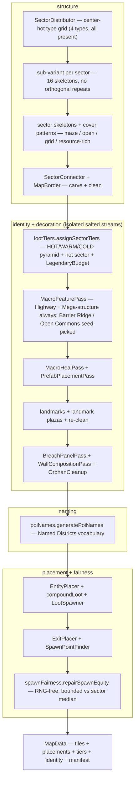
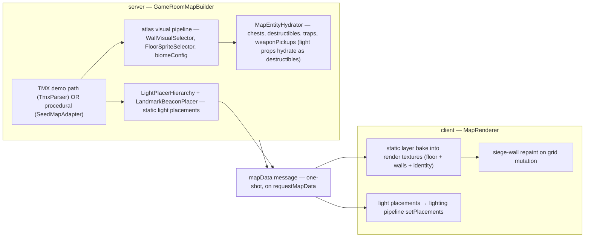

# Map generation — seeded pipeline and Named Districts

The entire generator lives in `packages/shared/src/map/` — a deterministic, seeded pass pipeline that turns a seed into a full `MapData`: tiles, entity placements, loot tiers, and the map's named identity. The design of record for the identity layer is ADR-0038; the effort docs live in `docs/design/map-redesign/`.

## Determinism first

Every random decision draws from **isolated XOR-salted RNG streams** derived from the map seed (`rng/SeededRNG.ts`) — one stream per concern, salts documented at each stream (ADR-0035). Decoration passes never touch the main stream. Same seed → byte-identical map, anywhere it's generated. The zone's finale placement is landmark-biased but equally seed-determined (`zoneSeed.ts`, phase 6 only).

## The pipeline

`MapGenerator.runPipeline(seed, rng)` — verified pass order:

Structural vocabulary (full definitions in [glossary.md](../glossary.md)): each 20×20 sector is one of four fixed **types** (GridArena / OpenArena / Maze / ResourceRich — each with one gameplay purpose, one biome, one shared balance budget), materialized through one of four **sub-variant skeletons** per type; **macro features** (the 3-tile Highway spine, the 10×10 Mega-structure landmark, seed-picked Barrier Ridge or Open Commons) overwrite seams to give the map identity; **refinement passes** heal and validate the result.

## Named Districts (ADR-0038)

Every generated map is a set of named districts. Identity data is authored by shared generation, rides `MapData`, and is consumed server-side + baked client-side — server-authoritative with zero per-frame client cost:

- **POI naming** — `poiNames.ts`: per-type prefix × per-sub-variant noun pools compose unique sector names; macro features get fixed-vocabulary names; the designation (`RINGROAD • SPIRE • 63`) derives from macro rolls. Client surfaces: minimap labels, enter-banners, kill-feed location tags, results line.
- **Landmark registry** — `landmarkRegistry{,Data}.ts` + `landmarks.ts`: exactly one hero landmark per sector on its skeleton's anchor site (baked composites, one RARE variant per type, adjacent sectors never share a composition); minor landmarks at junction nodes; each hero carries a tier-colored beacon.
- **Tier pyramid** — `lootTiers.ts`: seed-authored HOT (2–3, center cluster) / WARM (~8) / COLD (~5 outer) per-sector tiers drive chest + ground-weapon tables as the single source of truth; one per-match hot sector (a WARM promoted, minimap-marked); a map-wide ~10-item LegendaryBudget. GDD §5.6.1 is the table of record.
- **Identity sheets** — `identitySheets.ts` (authored: material fiction, wall tints, floor-field families, gateway spec, weather bias) + `visualIdentity.ts` (generated: seeded macro tint fields, 24 pure-geometry gateway dressings). Bake-time only; grayscale double-coding is an asserted gate.
- **Lighting hierarchy** — server-side placement config (see below): beacons > POI glow > route-biased sconces > deliberate dark pockets; ≤3 light hues per sector viewport.
- **Fairness gates** — `spawnFairness{,Model}.ts`: per-spawn value vectors (weapon/chest/clump proximity + path-to-HOT) bounded against the per-sector median (≤1.3×) with RNG-free repair; distribution sweeps + a generation manifest riding the benchmark JSON.

## Server hydration + client bake

From `MapData` to live entities and rendered tiles — the two-stage producer/consumer path through the one-shot `mapData` message:

The demo TMX path and the seed path share the exact render + collision pipeline (both emit `EnrichedMapData` of `{spriteId, rotation, flip}` + atlas colliders) — only the tile *decision* differs (human-authored vs autotiler). Wall collision derives solely from the chosen sprite's colliders transformed by rotation/flip (ADR-0023) — the rendered sprite **is** its collider. The client bakes static layers once; only grid mutations (siege, destruction) repaint.
