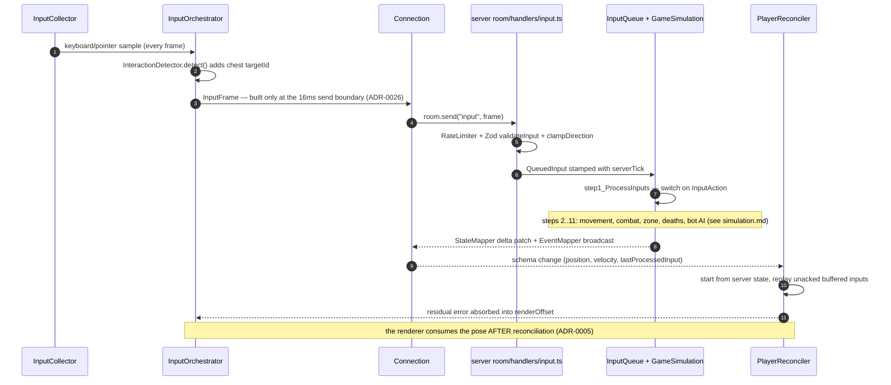
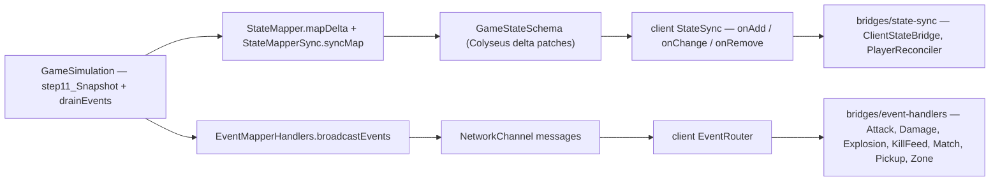

# Netcode — the input round trip

This is the project's #1 critical path: one input's journey from keyboard/pointer to authoritative simulation and back to a reconciled visual. The client predicts **movement only**; the server decides everything.

## The round trip

### The input path, end to end

1. `InputCollector` samples raw input — `isDown` for continuous actions (movement, ATTACK via pointer), `JustDown` for edge-triggered ones (PICKUP, DASH, THROW, SWITCH_SLOT). Mixing these up is the classic bug (see [gotchas.md](../gotchas.md)).
2. `InputOrchestrator.collect()` is the entry point: it delegates sampling to `InputCollector`, runs `InteractionDetector.detect()` (32px proximity scan → `targetId` for the chest prompt), and builds the network `InputFrame {movementX, movementY, aimAngle, sequence, actions[], targetId?}` only at the 16ms send boundary — the zero-alloc hot path from ADR-0026.
3. `Connection.sendInput` → `room.send('input', frame)`.
4. Server `handlers/input.ts` maps string actions → `InputAction` enum, rate-limits, Zod-validates, clamps directions.
5. `GameOrchestrator.handleInput` stamps a `QueuedInput` with `serverTick` into the `InputQueue` (dedup keeps only the latest MOVE per player per tick).
6. `GameSimulation.step1_ProcessInputs` switches on each action; movement uses the shared, frame-rate-independent acceleration (DASH exempt — ADR-0008).
7. The results flow back on **two channels** (below); the client reconciles position from state and plays feel from events.

## The dual-channel sync

Colyseus gives us two wires and we use both deliberately:

| Channel | Carries | Consumes |
| --- | --- | --- |
| **State** (schema deltas) | positions, health, inventory, phase, entity collections (9 synced: players, projectiles, destructibles, chests, weaponPickups, traps, powerUps, explosions, exits) | `StateSync` → `ClientStateBridge` → `GameState` (authoritative client state) |
| **Events** (messages) | attacks, damage numbers, explosions, kill feed, pickups, zone warnings, match start/end | `EventRouter` → per-event handlers → renderers/VFX/HUD |

`syncEveryN = TICK_RATE / PATCH_RATE = 1` — state is mapped every tick. `StateMapperSync.syncMap` mirrors domain collections into the schema's `MapSchema`s via a table-driven row sync (create/project/delete, zero alloc).

## Client prediction internals

- **`InputBuffer`** wraps the shared `InputRingBuffer` — a `Float64Array` ring, **stride 21** (13 base fields: seq, actionBitmask, dx, dy, aimAngle, timestamp, predictedX/Y, velocityX/Y, speed, dt, subSteps — plus 2×4 substep direction slots), 120-tick history (ADR-0007).
- **`Reconciler`** — on each server ack (`lastProcessedInput` is per-player, not global, ADR-0005): start from the server's position **and velocity**, replay unacked inputs forward, compare against prediction.
- **`renderOffset`** absorbs residual error so the simulation snaps to truth while visuals stay smooth: errors <1px ignored, 1–8px smoothed by an exponentially decaying correction offset, ≥8px (vector magnitude) hard-snapped — the adaptive snap (ADR-0014).
- **`ClientCollisionService`** predicts collision with the same 4-corner hitbox check the server path uses, so prediction doesn't drift into walls.
- **`EntityInterpolator`** — remote entities: 67ms buffer, 10-snapshot ring, linear interpolation, 64px snap threshold (ADR-0015, ADR-0020).
- **Latency compensation** is server-side and capped at `min(RTT/2, warmup, 100ms)`, applied to ATTACK/THROW windup timing and PICKUP historical proximity only — no re-simulation (ADR-0006).

## In-match reconnection

A dropped client's player is retained through a grace window (0–30s frozen + reconnectable; 30–60s unfrozen but input-less; at 60s a bot takes over the entity). On rejoin, `ReconnectionManager` replays the phase-2 re-entry (`PHASE2_ENTER` events processed in `GameSimulation.processReconnectionEvents`), and the client rebuilds from a fresh full-state snapshot + the one-shot `mapData` message.

## Netcode constants

The verified table (GDD §16 + §0 outrank everything when conflicting):

| Constant | Value | Notes |
| --- | --- | --- |
| `TICK_RATE` | 60 Hz | Server simulation rate (`NETWORK.TICK_INTERVAL`) |
| `PATCH_RATE` | 60 Hz | State sync every tick (ADR-0014; `syncEveryN = 1`) |
| `INPUT_BUFFER_SIZE` | 120 | Prediction input history (ticks) |
| `INPUT_FRAME_STRIDE` | 21 | 13 base fields + 2×4 substep directions |
| `RECONCILIATION_THRESHOLD` | 1 px | Below: ignore prediction error |
| `RENDER_OFFSET_SNAP_THRESHOLD` | 8 px | Vector magnitude; ≥ snaps, < decays (ADR-0014) |
| `ERROR_DECAY_RATE` | 60 | Correction-offset exponential decay |
| `PLAYER.BASE_SPEED` | 430 px/s | Do NOT rename — 30+ references |
| `PLAYER.ACCELERATION` / `DECELERATION` | 4800 / 6400 px/s² | Time-based, shared by client + server (ADR-0008) |
| `PLAYER.HITBOX` | 96×96 px | AABB server-side; 4-corner check client-side (`PLAYER_RADIUS = 48`) |
| `PICKUP_RADIUS` | 64 px | Server-authoritative weapon pickup distance |
| `INTERACTION_RADIUS` | 32 px | Client chest-prompt proximity (server chest is `targetId`-based) |
