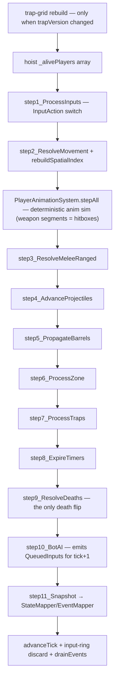
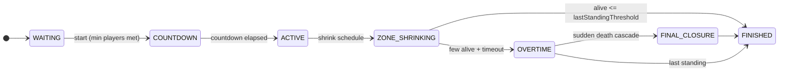
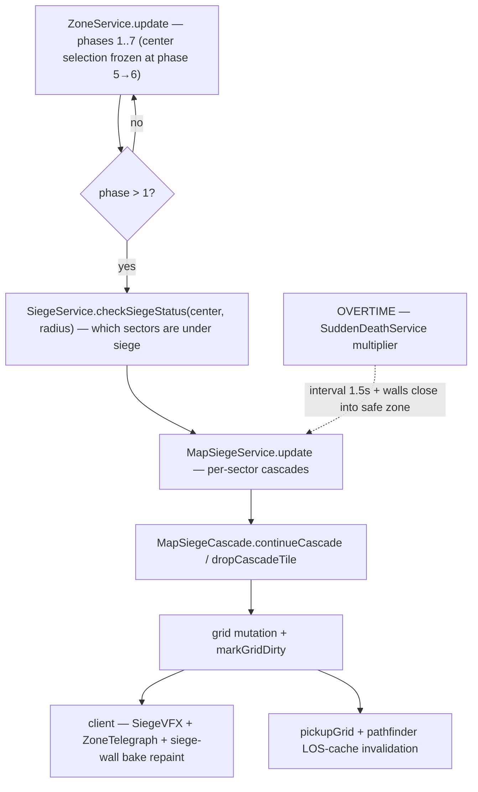

# Simulation — the 60Hz server tick

One authoritative tick, every 16.67ms, in a **fixed step order**. The order is load-bearing, not stylistic: the alive-set invariant (deaths flip only in step 9) and the spatial-index freshness contract (rebuilt right after movement) let later steps make unguarded assumptions.

## The tick pipeline

`GameSimulation.step()` — verified order, mirrored top-to-bottom in the code:

Why the placements matter:

- **Spatial index rebuild after step 2** — the five combat scan sites in `CombatSpatialQueries` read the index unguarded; combat (steps 3–5) must see post-movement positions.
- **Animation between movement and combat** — `PlayerAnimationSystem.stepAll` runs the shared deterministic animation sim so melee hitboxes (weapon segments) are current for step 3 (see [client.md](client.md#the-deterministic-animation-sim--ik) for the sim itself).
- **Deaths only in step 9** — everything upstream can treat the alive set as constant for the whole tick; `DeathResolutionService.dieWithTick`/`completeDeath` + elimination fan-out happen once.
- **Bot AI last-but-one** — bots observe the fully-resolved tick and their inputs re-enqueue for `tick + 1`, exactly like queued human input arriving one tick late.
- **Profiling** — `TickProfiler` times each step against the ADR-0025-pinned label set; `TickTimer` governs the `MAX_STEPS = 1` no-spiral-of-death policy (slow down, never catch-up-storm).

The orchestrator wraps all of this: `GameOrchestrator.update` runs phase transitions, zone/siege wiring, stimulus ingestion for bots, and elimination processing around the simulation step. Game timers (cooldowns, zone phases) are tick-based, so time dilation under load slows gameplay proportionally instead of breaking correctness.

## Match phase machine

Phases are a server-owned state machine (`shared/src/enums/MatchPhase.ts` — note the non-sequential enum values; they're a frozen wire contract), driven once per tick by `tickPhaseTransitions` in `GameOrchestratorPhases.ts`:

- **WAITING → COUNTDOWN** requires the minimum player count (`MIN_PLAYERS = 32`, humans + bots).
- **Late join** re-enters during ACTIVE..OVERTIME via `addPlayer` (revive path).
- **OVERTIME** engages `SuddenDeathService` (zone freeze at 8% radius, accelerated siege); **FINAL_CLOSURE** seals the arena.
- End conditions are gated by `setLastStandingThreshold` — `1` is natural battle-royale; `≤0` disables the alive-count end (used by tests/benchmarks to exercise late phases).
- The room loop: `GameRoomLifecycle` calls `setSimulationInterval(onSimulationTick, NETWORK.TICK_INTERVAL)`.

## Zone siege cascade

As the zone shrinks past sector rings, per-sector cascades progressively smash ring wall tiles on a telegraphed cadence — the "closing coffin" that forces engagement:

- Only sectors whose center falls outside the zone circle are sieged; tiles drop furthest-from-center first, in rings.
- A **0.5s telegraph** precedes each drop; players standing on a solidifying tile take the invulnerability-bypassing siege crush.
- The orchestration gate lives in `GameOrchestrator.update` (phase > 1, overtime interval swap, `match.markGridDirty()`).
- Grid mutation is the invalidation event for the bot pathfinder LOS caches and pickup grids.

## Deaths and eliminations

Step 9 resolves HP=0 once: death animation state (0.5s, body keeps collision) → weapon drop ring → effect cancellation → `PLAYER_ELIMINATED` domain event. That event fans to three consumers — elimination records (schema → results screen), the bot stimulus router + kill-feed memory, and the client kill feed. The full flow is diagrammed in [combat-and-loot.md](combat-and-loot.md#eliminations--kill-feed).
